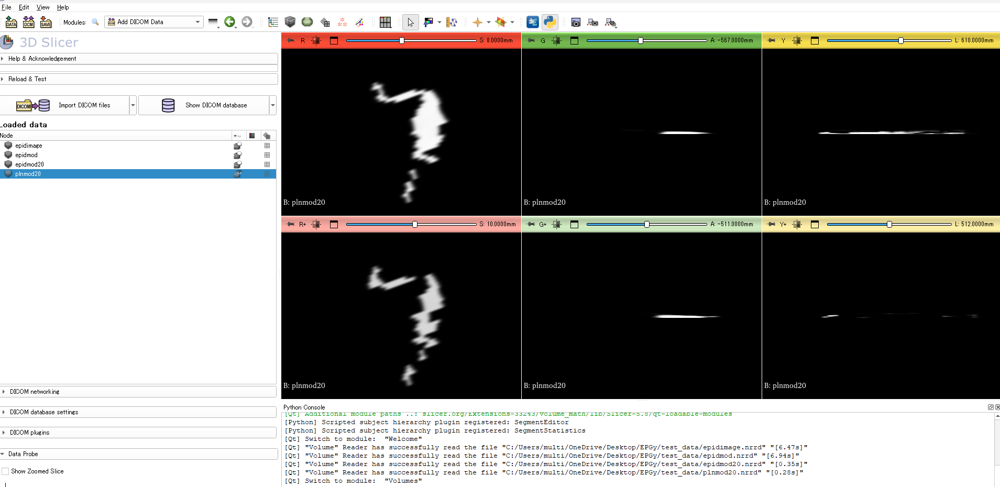

# PerpendicularSplitQA — VMAT EPID患者固有QAのための3自由度ガンマ解析


## 概要

VMAT（強度変調回転放射線治療）の患者固有QAにおいて、EPID（電子ポータル画像装置）を用いたトランジット線量測定に対応した、**3次元（3DOF）ガンマ解析ツール**です。

従来の2Dガンマ解析は線量差（DD）と一致距離（DTA）の2軸で評価します。本ツールはこれに**ガントリー回転角度差（Δθ）**を加えた第3の評価軸を独自に実装し、アーク回転に伴う照射エラーをより高感度に検出することを目的としています。

解析結果は**NRRD形式**で出力され、**3D Slicer**上での3次元可視化に直接対応しています。

---

## 開発背景・臨床的意義

標準的なVMAT QAは計画線量と照射線量を単一平面で比較します。しかし、MLCの位置誤差・ガントリー速度の変動・線量率の変動といった照射エラーは、空間的なズレよりも**角度方向のズレ**として現れることがあります。

本ツールはこの課題に対し：
- 角度方向の照射誤差を定量化する第3のガンマ基準を追加
- アーク回転軸に沿ったフレーム単位のQAを実現
- (x, y, θ)の3次元ガンママップを3D Slicer上で直感的に確認可能

---

## 機能

- **3DOFガンマインデックス**の計算
  - 線量差（DD）— デフォルト許容値：3%
  - 一致距離（DTA）— デフォルト許容値：2 mm
  - 角度差（Δθ）— デフォルト許容値：3°
- `multiprocessing`によるDD・DTA・Δθの並列計算
- TkinterによるGUIファイル選択
- DICOM RTプランの解析（`rtplan_reader.py`）・EPID画像の展開（`epidmovie_reader.py`）
- **3D Slicer**対応の`.nrrd`形式で出力
- **Elekta iView EPID**データ対応（0.25 mm/pixel）

---

## 技術スタック

| コンポーネント | 技術 |
|---|---|
| 言語 | Python 3.8+ |
| 画像処理 | NumPy, OpenCV,Pillow |
| DICOM処理 | pydicom |
| 3D出力 | pynrrd |
| 並列処理 | multiprocessing |
| 可視化 | 3D Slicer（外部ツール） |

---

## アルゴリズム

3DOFガンマインデックスは以下の式で定義されます：

$$\gamma = \sqrt{\left(\frac{\Delta D}{\delta_{DD}}\right)^2 + \left(\frac{\Delta d}{\delta_{DTA}}\right)^2 + \left(\frac{\Delta\theta}{\delta_{\theta}}\right)^2}$$

- $\Delta D$：計画値とEPID実測値の線量差
- $\Delta d$：一致距離（mm）、探索領域内で補間計算
- $\Delta\theta$：角度差（度）、アーク軸方向に補間計算
- $\delta_{DD}, \delta_{DTA}, \delta_{\theta}$：各許容値

角度差の計算は、DTA計算と同様の補間アルゴリズムを角度軸方向に適用し、参照値と計測値が一致するガントリー角度を線形補間で推定します。

> **注記：** 角度次元の追加は独自の拡張実装です。標準的な2Dガンマ定式化はLow et al.（Med Phys, 1998）に準拠しています。ガントリー角度許容値の参考値はRowshanfarzad et al.（Med Phys, 2013）を参照しています。

---

## 処理フロー

```
DICOM RTプラン (.dcm)         EPID画像データ (.dcm)
        │                             │
  rtplan_reader.py           epidmovie_reader.py
        │                             │
  プランTIFFスタック          EPIDTIFFスタック
        │                             │
        └──────────┬──────────────────┘
                   │
        ImageJ：フレーム位置合わせ・トリミング
                   │
         PerpendicularSplitQA.py
                   │
      ┌────────────┼────────────┐
      │            │            │
   DDマップ     DTAマップ    Δθマップ
      └────────────┼────────────┘
                   │
            ガンママップ (.nrrd)
                   │
              3D Slicer
```

---

## インストール

```bash
pip install opencv-python numpy pydicom tifffile pillow pynrrd
```

---

## 使用方法

```bash
python PerpendicularSplitQA.py
```

1. **プランTIFFスタック**を選択（`rtplan_reader.py` + ImageJで前処理済みのもの）
2. **EPIDTIFFスタック**を選択（`epidmovie_reader.py` + ImageJで前処理済みのもの）
3. Gamma・DD・DTA・Δθの各`.nrrd`ファイルが保存される
4. **3D Slicer**で結果を3次元確認



> 前処理の注意：両TIFFスタックはフレーム数を揃え、空間的な位置合わせを行った上で実行してください。

---

## 出力ファイル

| ファイル | 内容 |
|---|---|
| `gamma_result.nrrd` | 3DOFガンマインデックスマップ |
| `dd_result.nrrd` | 線量差マップ |
| `dta_result.nrrd` | 一致距離マップ |
| `ang_result.nrrd` | 角度差マップ |

---

## 処理時間の目安

画像スタックのサイズとCPU性能に依存します。  
参考値：11フレームのTIFFスタックで中程度のスペックのノートPCにて約45分。  
DD・DTA・Δθの並列化により実処理時間を短縮しています。

---

## 参考文献

- Low et al., *Med Phys* 1998 — ガンマインデックスの原典定式化
- Depuydt et al., *Radiother Oncol* 2002 — アルゴリズム実装の参考
- Miften et al. (AAPM TG-218), 2018 — 3%/3mm臨床標準
- Rowshanfarzad et al., *Med Phys* 2013 — ガントリー角度許容値の参考値

---

