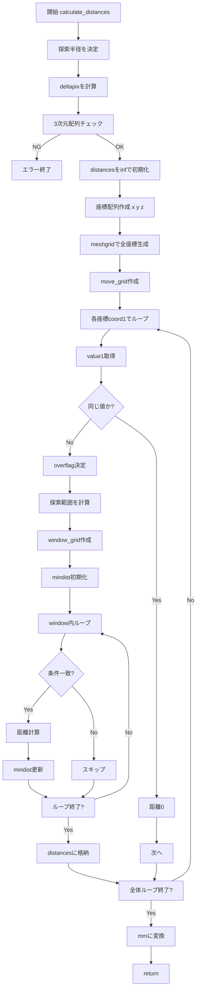

```mermaid
flowchart TD

    A[開始 calculate_distances] --> B[探索半径を決定]
    B --> C[deltapixを計算]
    C --> D[3次元配列チェック]

    D -->|NG| E[エラー終了]
    D -->|OK| F[distancesをinfで初期化]

    F --> G[座標配列作成 x y z]
    G --> H[meshgridで全座標生成]
    H --> I[move_grid作成]

    I --> J[各座標coord1でループ]

    J --> K[value1取得]
    K --> L{同じ値か?}

    L -->|Yes| M[距離0]
    M --> N[次へ]

    L -->|No| O[overflag決定]

    O --> P[探索範囲を計算]
    P --> Q[window_grid作成]

    Q --> R[mindist初期化]
    R --> S[window内ループ]

    S --> T{条件一致?}
    T -->|Yes| U[距離計算]
    U --> V[mindist更新]

    T -->|No| W[スキップ]

    V --> X[ループ終了?]
    W --> X

    X -->|No| S
    X -->|Yes| Y[distancesに格納]

    Y --> Z[全体ループ終了?]
    N --> Z

    Z -->|No| J
    Z -->|Yes| AA[mmに変換]

    AA --> AB[return]
```